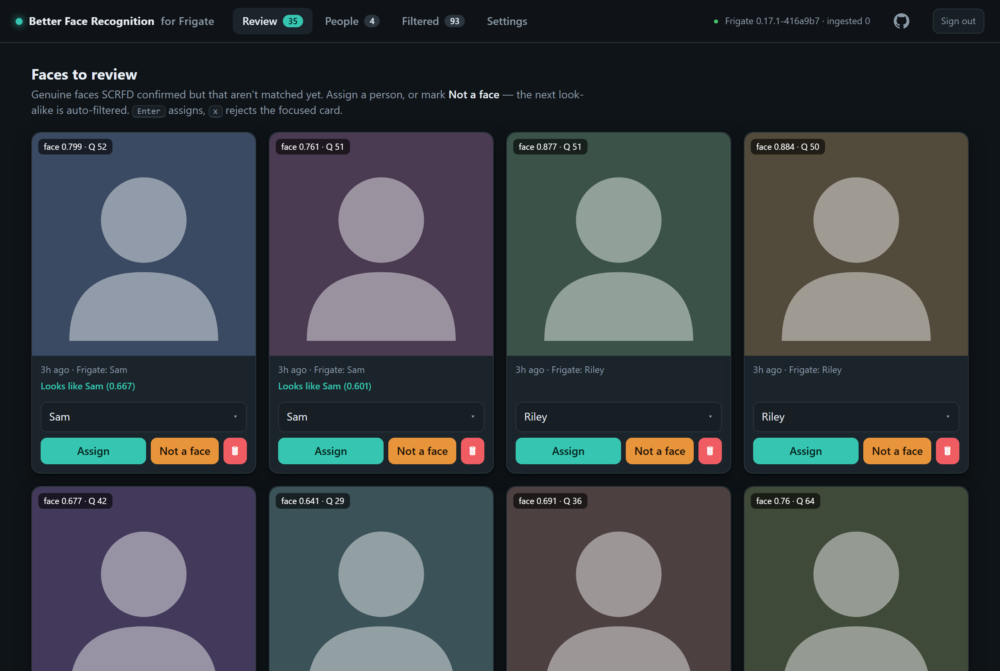
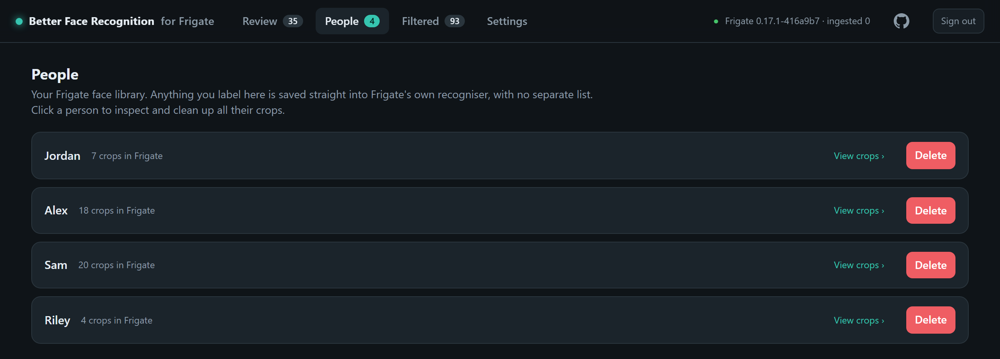
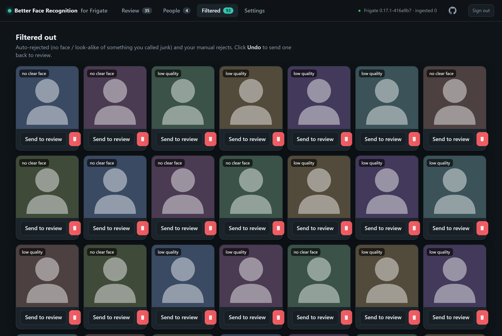
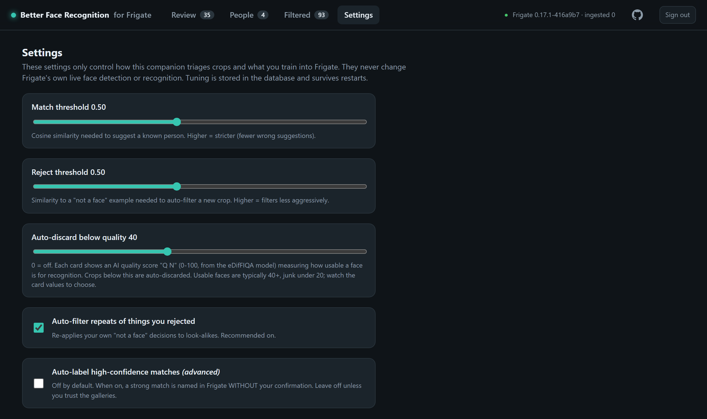

# frigate-better-face-recognition

A lightweight companion for [Frigate](https://frigate.video) that fixes the two
things Frigate's built-in face recognition can't do on its own: it **filters out
the junk** (blurry partials, and the non-faces Frigate's detector hallucinates,
like car wheels) and gives you a **fast UI to label only the genuine faces** as
an existing or new person, or to mark something **"not a face" so look-alikes are
auto-filtered from then on.** Your labels are also trained back into Frigate's
own recogniser, so Frigate keeps getting better too.

It runs entirely locally, on CPU, alongside Frigate. No cloud, no GPU, no fork
of Frigate.

> Why this exists: Frigate's recogniser (ArcFace) is good, but its free face
> *detector* is a lightweight CPU model that frequently flags non-faces, and the
> Train tab shows every crop with no quality gate and no way to teach it that
> something is not a face. This tool adds exactly those missing edges.

## How it works

```
Frigate (detects faces, high recall)  ──saves crops──▶  /api/faces (train/)
                                                            │  poll
        ┌───────────────────────────────────────────────────┘
        ▼
  SCRFD: is a real face present?  ──no──▶  filtered out (e.g. a wheel)
        │ yes
   ArcFace embedding (512-d)
        │
  ┌─────┴───────────────┬──────────────────────┐
  nearest person     nearest "not a face"     neither
  (>= threshold)        (>= threshold)            │
        │                   │                     ▼
   SUGGEST it          auto-filter          Review queue
  (you confirm)       (your prior call)     (you label it)
```

- **SCRFD** (a real face detector) verifies every crop, so non-faces are dropped
  on day one, before you've labelled anything.
- **ArcFace** turns each face into an embedding used both to match known people
  and to cluster junk: tag one wheel "not a face" and every future wheel lands
  next to it and is auto-filtered.
- Both models come from the maintained
  [InsightFace](https://github.com/deepinsight/insightface) `buffalo_l` pack and
  run on CPU. They load only while you are reviewing and are released when idle
  (see [Resource use](#resource-use)), so the background cost is just the web server.

## Screenshots

> Names and faces below are placeholders; the real data is anonymized.

|  |  |
| --- | --- |
| **Review** — confirm a suggested person, reassign, mark "not a face", or open the whole-scene snapshot (🔍) to identify someone the face crop alone can't | **People** — your Frigate face library, with real crop counts |
|  |  |
| **Filtered** — non-faces and low-quality crops, one click back to review | **Settings** — thresholds and the quality auto-discard gate |
|  |  |

## Human in the loop

| Action | Automatic? | Why |
| --- | --- | --- |
| Sort crops into review / suggested / filtered | Yes | Triage only; no write to Frigate |
| **Give a crop a person's name** | **No, needs your click** | A wrong auto-label would poison Frigate's recogniser |
| Re-filter a look-alike of something you rejected | Yes | Re-applies a decision you already made |
| Auto-label strong matches without asking | Off by default (toggle) | Available, but opt-in |

So the only automatic write to Frigate is the opt-in **Auto-label**. Everything
else this tool decides on its own (sorting crops, re-filtering look-alikes of
your rejects) stays inside this tool and never changes Frigate.

### What the settings affect

Everything in **Settings** governs only this companion's curation: how it sorts
Frigate's crops into review / suggested / filtered, and (for labels) what you
train into Frigate. None of it changes Frigate's own live face detection or
recognition (inference). In particular, the **auto-discard quality** threshold
only files low-quality crops under "Filtered" here, keeping them out of your
review queue and out of training; the crop is not deleted from Frigate, and
Frigate still detects and labels that face live exactly as before. The only
things that ever reach Frigate are your explicit **Assign** (trains the
recogniser) and **Not a face** (deletes that crop in Frigate) actions, plus the
opt-in Auto-label.

## Install

It builds from source (no prebuilt image is published). Add it next to Frigate and
let Compose build it; it talks to Frigate's internal, unauthenticated API:

```yaml
services:
  better-face-recognition:
    build: https://github.com/mayerwin/frigate-better-face-recognition.git
    restart: unless-stopped
    environment:
      FRIGATE_URL: "http://frigate:5000"
    volumes:
      - ./bfr-data:/app/data     # your labels + model cache; back this up
    ports:
      - "8975:8975"
```

Bring it up with `docker compose up -d --build`. To pick up later improvements,
`docker compose build --pull && docker compose up -d` rebuilds from the repo.
`FRIGATE_URL` must reach Frigate's API, so share Frigate's docker network (or
point it at the right host:port). Then open `http://<host>:8975`. See
[`docker-compose.example.yml`](docker-compose.example.yml). Face recognition must
be enabled in Frigate.

## Configuration

Only `FRIGATE_URL` is required. Tunables are seeded into the database on first
run and managed from the Settings tab afterwards (a restart won't reset them).

| Variable | Default | Meaning |
| --- | --- | --- |
| `FRIGATE_URL` | `http://frigate:5000` | Frigate's internal API |
| `PORT` | `8975` | Web UI port |
| `MODEL_NAME` | `buffalo_l` | InsightFace model pack (SCRFD + ArcFace) |
| `POLL_INTERVAL` | `10` | Seconds between train-folder polls |
| `MATCH_THRESHOLD` | `0.5` | Cosine similarity to suggest a known person |
| `REJECT_THRESHOLD` | `0.5` | Similarity to a reject to auto-filter |
| `AUTO_REJECT` | `true` | Re-apply your "not a face" decisions |
| `AUTO_LABEL` | `false` | Name strong matches without confirmation (advanced) |
| `FRIGATE_WRITEBACK` | `true` | Train/delete in Frigate on your actions |
| `AUTH` | `frigate` | `frigate` = sign in with your Frigate login; `none` = open |
| `DET_THRESHOLD` | `0.5` | SCRFD detection sensitivity; lower surfaces more borderline/blurry faces |
| `BLUR_THRESHOLD` | `0` | Auto-discard faces below this eDifFIQA quality score (0-100); 0 = off, tune in the UI |
| `RETENTION_AUTO_REJECTED_DAYS` | `90` | Auto-delete auto-rejected (and already-deleted) crops from this tool's DB after N days; 0 = keep forever |
| `RETENTION_REVIEW_DAYS` | `365` | Auto-delete un-reviewed crops after N days; 0 = keep forever |
| `FIQA_VARIANT` | `l` | eDifFIQA quality model size: `t`/`s`/`m`/`l` (`l` = best/largest, `t` = 7 MB tiny) |
| `MODEL_IDLE_TTL` | `180` | Seconds of no face scoring before the models unload to free RAM |
| `UI_ACTIVE_WINDOW` | `30` | Seconds after the last Review poll that new crops keep being ingested |
| `NGINX_AUTOCONFIG` | `true` | Inject the button into Frigate's `/faces` page (see below); `false` disables it |
| `BFR_UPSTREAM` | `better-face-recognition:8975` | This container's `name:port` that Frigate's nginx proxies `/__betterfaces/*` to |
| `FRIGATE_CONTAINER` | `frigate` | Frigate's docker container name (the integrator `docker exec`s into it) |
| `BFR_PUBLIC_URL` | (derived) | Button target; default `http://<host-you-reach-Frigate-on>:BFR_PUBLIC_PORT/` |
| `BFR_PUBLIC_PORT` | `PORT` | Port used when deriving the button target URL |
| `BFR_FRIGATE_UI_URL` | (derived) | "Back to Frigate" home button target; default `https://<host>:8971/` |

## Authentication

By default (`AUTH=frigate`) the UI requires a login validated against Frigate's
own user database, so you sign in with the **same credentials as Frigate** and
have nothing extra to manage. On success it sets its own signed-cookie session.
Set `AUTH=none` only if you front the app with your own reverse-proxy auth or a
VPN. The companion still reaches Frigate's data API on the internal unauthenticated
`:5000`; auth only gates the human-facing UI.

## Faces-page button

For one-click access, this tool can add a **"Better Face Recognition"** button to
Frigate's own **Face Library** (`/faces`) page, right after the "Recent
Recognitions" selector. Clicking it opens this tool in a new tab.

Frigate has no frontend plugin API, so the button is added by making Frigate's
own nginx inject a `<script>` and route a private `/__betterfaces/` path back to
this container. That is done through the shared **`frigate-ext`** protocol
([spec](https://github.com/mayerwin/frigate-layout-sync/blob/main/PROTOCOL.md)),
so it coexists race-free with other Frigate companions that inject UI the same way
(e.g. [frigate-layout-sync](https://github.com/mayerwin/frigate-layout-sync)). The
edit is self-healing: it re-applies whenever Frigate restarts or is upgraded, and
the injected route uses a lazy `proxy_pass`, so if this tool is down that path
just `502`s and Frigate's own UI is never affected.

To enable it, mount the Docker socket and put this container on Frigate's network
so its nginx can reach you by name:

```yaml
    volumes:
      - /var/run/docker.sock:/var/run/docker.sock   # lets it edit Frigate's nginx
    environment:
      BFR_UPSTREAM: "better-face-recognition:8975"   # = this service's container_name:port
    networks: [frigate_default]
```

It is best-effort: without the socket it logs the two manual nginx lines instead
and the tool still runs on its own port. Set `NGINX_AUTOCONFIG=false` to disable.
The tool's own dashboard also has a **home button (top-left) back to Frigate**
(`BFR_FRIGATE_UI_URL`, default `https://<host>:8971/`).

## Face quality

Each crop gets a **quality score (0-100, shown as "Q N")** from
[eDifFIQA](https://github.com/yakhyo/face-image-quality-assessment), a SOTA
no-reference face-image-quality model (ranked #1 on the NIST FATE Quality
leaderboard with the `l` variant). It predicts how *usable* a face is for
recognition rather than measuring raw sharpness, so it correctly scores tiny,
dark, off-angle or low-detail crops as poor where a pixel-sharpness heuristic is
fooled. It runs on CPU via onnxruntime (a small extra model, downloaded and
cached once next to the InsightFace models). Set `BLUR_THRESHOLD` (or the
Settings slider) to auto-discard crops below a quality you choose -- usable faces
are typically 40+, junk under 20. Crops with no detectable face at all are filed
under "no clear face" and filtered regardless. `FIQA_VARIANT` picks the model
size (`l` default; `t` is a 7 MB tiny option).

## Resource use

Idle cost is deliberately low. The face models (InsightFace + eDifFIQA, ~0.8 GB)
load only while the **Review** tab is open (or when Auto-label is on) and are
released after `MODEL_IDLE_TTL` seconds with no face to score, returning the
memory to the OS. So when you are not reviewing, the container is just the web
server (about 50 MB on a fresh start, ~180 MB once a prior session has imported
the ML libraries) and CPU is ~0; while you are actively reviewing it rises to
~0.9 GB, then falls back. Opening the Review tab
reloads the models within a few seconds and ingests any crops that arrived since
you last looked. Frigate keeps a rolling buffer of the most recent face attempts
(its `save_attempts`, default 200, deleted oldest-first), so nothing is missed as
long as you review within that window; raise Frigate's `save_attempts` if your
cameras are busy or you review infrequently. Raise `MODEL_IDLE_TTL` to keep the
models warm longer between sessions, or enable Auto-label to ingest continuously.

## Data and backup

All durable state is **one SQLite file** at `/app/data/bfr.db` (your people,
labels, embeddings, "not a face" memory, and crop thumbnails as blobs). Back up
that file; everything else under `/app/data` is a re-downloadable model cache.

### Retention

The classifier only ever uses the crops **you** decided on: labelled faces
(positive gallery) and "not a face" examples (negative gallery). Everything else
(auto-rejected junk, un-reviewed crops, delete-forever tombstones) is triage
history that would otherwise pile up in `bfr.db` forever. So two age-based
retention settings auto-prune it (tune or disable them in **Settings**):

- **`RETENTION_AUTO_REJECTED_DAYS`** (default `90`): deletes auto-rejected and
  already-deleted crops older than this.
- **`RETENTION_REVIEW_DAYS`** (default `365`): deletes crops left un-reviewed
  this long.

In the UI each is a checkbox (on by default) with a day count; unticking it keeps
those crops forever (the env vars use `0` for the same thing). Retention **never**
touches your labelled faces or your "not a face" examples, so it can't affect
recognition or what's trained into Frigate. Crops this old are long gone from
Frigate's `save_attempts` buffer, so pruning them can't trigger a re-ingest. A
large first cleanup also compacts the database file to hand freed space back to
the OS.

## Privacy

Everything runs on your hardware. No image or embedding ever leaves the machine;
the only network calls are to your own Frigate.

## Development

```bash
pip install -r requirements-dev.txt
pytest            # logic + API tests (no ML models needed)
```

The classifier and storage are pure and unit-tested; the API is tested with a
fake Frigate client and a fake embedder, so the suite runs anywhere.

## License

MIT (c) 2026 Erwin Mayer. Built to share.
